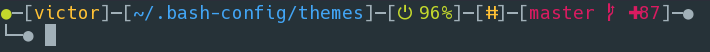
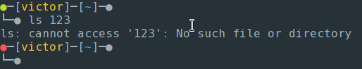
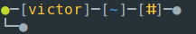
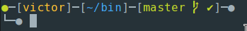
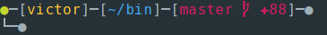

bubble-lines
===

A cool and bubbly prompt for Bash




The prompt provides the following information:
* Previous exit code
* Username
* Current path
* Battery status
* sudo cached credentials
* Git status

```
●─[victor]─[~/.bash-config/themes]─[⏻ 80%]─[ⵌ]─[master  ✚87]─●
|    |                 |              |      |         |- Git status
|    |                 |              |      |- sudo cached
|    |                 |              |- Battery status
|    |                 |- CWD
|    |- Username
|- Exit code
```

#### Exit status

The first bubble indicates the previous exit code (green = 0; red != 0)



#### Battery

The battery plugin displays a battery icon and battery percentage when the AC adapter is not present, or a charging icon when power is connected. Both icon and percentage are color coded, and change according to the battery status.

Enable it with:

```
battery_info="y"
```

**On battery power**


**Charging**


#### Sudo

Indicates when sudo credentials are cached.

Enable it with:



```
sudo_info="y"
```

#### Git

When browsing a git folder, the prompt will show a basic color coded git status for uncommitted/modified files (nothing else is shown).

**Git is clean**



**Git has uncommitted files**



Installation
---

Download `bubble-lines` to your machine (optionally make it hidden) and source it on your `${HOME}/.bashrc`.

```
. ${HOME}/.bubble-lines
```
